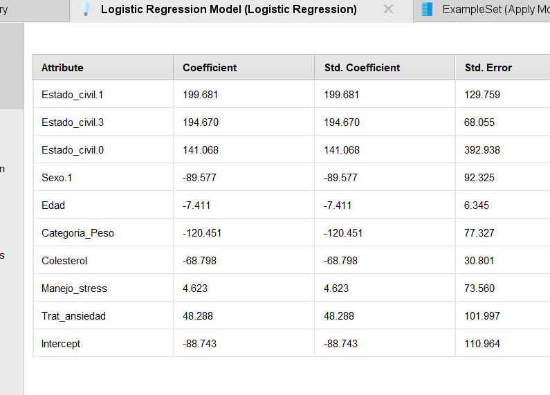
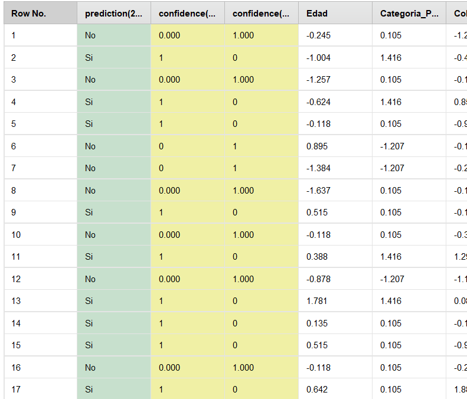

# Cardiac arrest

## Objetivo:

El objetivo de este problema es entrenar un modelo capaz de predecir un siguiente paro cardiaco en pacientes que ya han sufrido uno.

Disponemos de dos dataset ya separados, cardiac-training y cardiac-scoring , nos centraremos en el training, que es donde podremos evaluar nuestro modelo ya que es el que presenta variable objetivo.

### Predictores:

- Estado_civil:

codificado mediante un número: 0 = soltero; 1 = casado, 2 = divorciado y 3 = viudo. Sexo: 0 = femenino; 1= masculino.

- Categoria_Peso:

el peso de la persona, categorizado en uno de tres posibles niveles: 0 = normal; 1 = sobrepeso; 2 = obeso.

- Colesterol:

nivel de colesterol de la persona, tal como se ha registrado en el momento del tratamiento indicado cuando su más reciente ataque al corazón.

- Manejo_stress:

un atributo binario que indica si el paciente ha participado previamente de cursos de manejo del estrés: 0 = no; 1 = si.

- Trat_ansiedad:

valor entre 0 y 100 indicativo del nivel natural de estrés de cada persona y de su habilidad para manejar este estrés. Poco tiempo después de que la persona se recuperara de su primer ataque, se le administró un test de ansiedad natural estándar. Los valores están tabulados en incrementos de 5. Un valor de 0 indicaría que la persona nunca siente ansiedad, presión o estrés en ninguna situación, mientras que un valor de 100 indicaría que la persona vive en un estado continuo de sobrecarga e incapaz de lidiar con su situación.

- 2do_Ataque_Corazon:

Este atributo existe solamente en el dataset de entrenamiento. Es la variable objetivo o de predicción (“label” en RM). En el dataset de entrenamiento, este atributo contiene “SI” para aquellos individuos que han sufrido un segundo ataque al corazón, y “no” en caso contrario.

#### Modelo:

Dado el problema, queremos predecir una variable binomial, Si = en caso de que vaya a sufrir un segundo paro cardiaco; NO = en caso contrario. Decidimos optar por un modelo de Regresión Logística.

Preparación de datos:

Este modelo requiere que todos los predictores sean numéricos, no necesitamos convertirlos. Solo los normalizamos.

##### Resultados:

Una vez entrenado el modelo usando cardiac-training podemos ver los coeficientes para c/u de los predictores:

Aplicando el modelo a cardiac-scoring podemos ver si el modelo supone un paro cardiaco o no:

