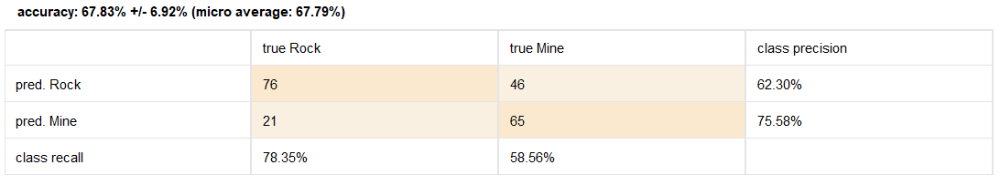

Sonar Detection

# Objetivo:

Predecir si el sonar marino equipado en un barco está detectando lecho marino o una posible mina anti-barcos. Para esto el Sonar emite ondas en varias frecuencias y recibe su rebote.

Además de la predicción, nos enfocamos en el Feature Selection y cómo varía la performance de nuestro modelo.

## Predictores:

Los predictores son los canales enviados , 1-60 , c/u emite sonido en su propia frecuencia (excluyentes) , los valores representan la energía de esa frecuencia en particular, con valores entre 0.0 y 1.0.
Podemos identificar la desviación y ver a primera vista que ciertos canales parecen más importantes:

Para mas información sobre el dataset visitar:
<a href="https://www.kaggle.com/datasets/rupakroy/sonarcsv/">https://www.kaggle.com/datasets/rupakroy/sonarcsv/</a>

### Modelo:

Dado el problema, queremos predecir una variable binomial, ROCK = en caso de piedras ; MINE = en caso de una mina anti-barcos

Utilizamos el modelo de clasificación Naive-Bayes para predecirlo.

#### Preparación de datos:

Nos centraremos en el feature Selection y compararemos entre ellos usando cross-validation.

##### Resultados:
Comparación de Selección de atributos:

- Todos los predictores:

- Aplicando Fordward Selection:

- Aplicando Backward Selection:

- Aplicando Evolution:

##### Conclusión:
Vemos que el proceso de selección evolutivo de atributos nos permite entrenar un modelo más preciso ; Incluso si tomamos todos los atributos, esto se debe al fenomeno del sobreajuste.

